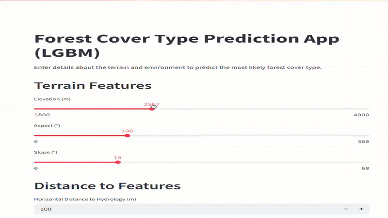

# 🌲 Forest Cover Type Prediction

This project uses machine learning techniques to predict the type of forest cover based on various cartographic attributes.
It aims to aid environmental researchers and forestry departments in understanding and classifying different forest regions more efficiently.

## 🚀 Features

- Data preprocessing and analysis
- Model selection and evaluation
- Flask-based web app for prediction
- Serialized trained model deployment
- Deployed on Streamlit

## 📁 Project Structure

```

├── app.py                      # Flask web app
├── forest cover ml.ipynb      # Jupyter Notebook with ML pipeline
├── best_forest_model.pkl      # Serialized model
├── train.csv                  # Dataset
├── requirement.txt            # Dependencies

```

## 🛠️ Installation

1. Clone the repository:

   ```bash
   git clone https://github.com/Hurmath123/Forest-Cover-Type-Prediction.git
   cd Forest-Cover-Type-Prediction
   ```

2. Install dependencies:

   ```bash
   pip install -r requirement.txt
   ```

3. Run the app:

   ```bash
   python -m streamlit run app.py
   ```

4. Open your browser and visit: `http://192.168.29.148:8501`

## 📽️ Demo Video




## 🧾 License

This project is licensed under the MIT License.
